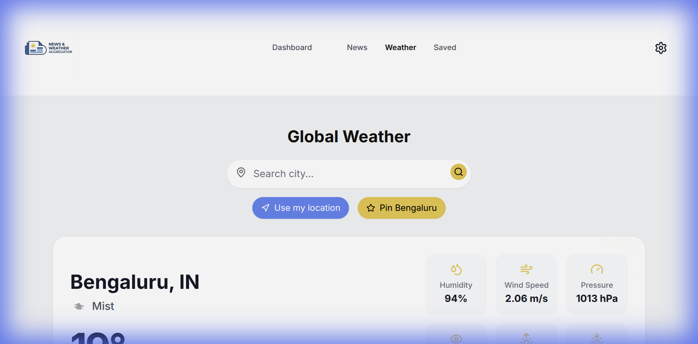
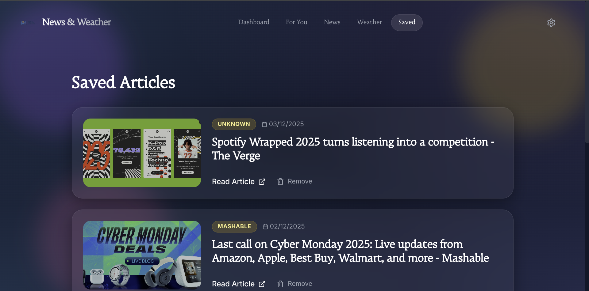

# News & Weather Aggregator

A comprehensive web application that aggregates real-time news and weather updates, featuring AI-powered summaries and personalized content.


##  Features

-   **Real-time News**: Fetch the latest headlines across various categories.
-   **Live Weather Updates**: Get current weather conditions and forecasts for any city.
-   **AI Summaries**: Leverage Google's Generative AI to summarize news articles.
-   **Saved Articles**: Bookmark important news for later reading.
-   **Responsive Design**: Built with a modern, mobile-first UI using Tailwind CSS.
-   **Interactive Dashboard**: Visualizations and easy navigation.
-   **For You Page**: Personalized news feed tailored to your interests.

##  Tech Stack

### Frontend
-   **React** (Vite)
-   **Tailwind CSS** for styling
-   **Framer Motion** for animations
-   **Recharts** for data visualization
-   **Lucide React** for icons
-   **React Router** for navigation

### Backend
-   **Node.js** & **Express**
-   **SQLite** (with Sequelize ORM) for database
-   **Google Generative AI** for content processing
-   **Axios** for external API requests

##  Screenshots

| Dashboard | News Feed |
|-----------|-----------|
|  |  |

| Weather Forecast | Saved Articles |
|------------------|----------------|
|  |  |

| For You Page |
|--------------|
|  |

##  Installation

### Prerequisites
-   Node.js (v14+ recommended)
-   npm or yarn

### 1. Clone the Repository
```bash
git clone <repository-url>
cd news-weather-app
```

### 2. Backend Setup
Navigate to the backend directory and install dependencies:
```bash
cd backend
npm install
```

Create a `.env` file in the `backend` directory based on `.env.example`:
```env
PORT=4000
# Add your API keys here (OpenWeather, NewsAPI, Gemini AI, etc.)
```

Start the backend server:
```bash
npm start
```

### 3. Frontend Setup
Navigate to the frontend directory and install dependencies:
```bash
cd ../frontend
npm install
```

Start the development server:
```bash
npm run dev
```

The application should now be running at `http://localhost:5173`.

## API Endpoints

-   `GET /api/news`: Fetch news articles
-   `GET /api/weather`: Get weather data
-   `GET /api/ai`: AI-related operations
-   `GET /api/pins`: Manage pinned locations
-   `GET /api/articles`: Manage saved articles

##  License

This project is licensed under the ISC License.
